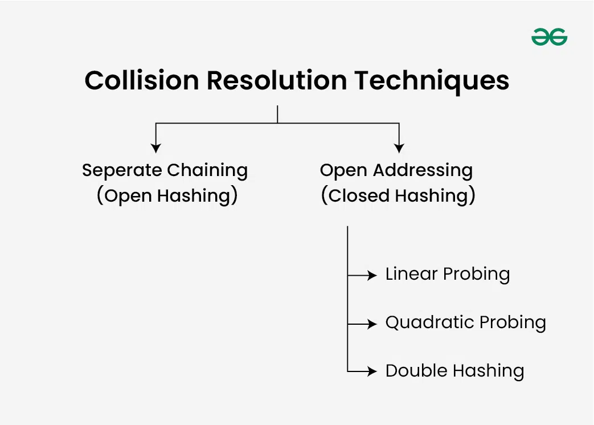

Dictionaries use hash table datastructure internally 
A hash function generates a unique hash code for each key, which determines the index in an underlying array (or bucket) and stores the value in that index.
Load Factor=
Number of elements stored / Size of the hash table

 *rehashing* means hashing again. Basically, when the load factor increases to more than its predefined value (the default value of the load factor is 0.75), the complexity increases. So to overcome this, the size of the array is increased (doubled) and all the values are hashed again and stored in the new double-sized array to maintain a low load factor and low complexity.

** Collision Handling Techniques**

